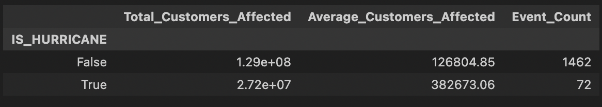
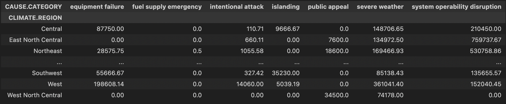

# Evaluating Customer Impact of Power Outages

Author: Kaijie Zhang

## Overview

This is the DSC project for DSC80. The project is investigating a dataset about significant power outages in US.

## Introduction

In the project, our dataset is about significant power outages experienced by various states across the continental U.S. In addition to details about these major outages, it provides information on the geographical locations of the outages, regional climate data, land-use features, electricity consumption trends, and the economic profiles of the affected states. The data is included in a single excel file containing 55 variables. 

The dataset is from https://engineering.purdue.edu/LASCI/research-data/outages. The definition reference of the data is from https://www.sciencedirect.com/science/article/pii/S2352340918307182.

During the project, I will have an overall ideas about the dataset and interesting features helping me to Evaluate Customer Impact of Power Outages.

The number of people affected has always been a very important indicator. When we assess the severity of a disaster or plan to compensate people, the number of people affected will determine the direction of decision-making.

These are the columns I selected for used. The original data includes 1534 rows and 57 columns.

| Column                     | Description                                                                                                                                    |
| :------------------------- | :--------------------------------------------------------------------------------------------------------------------------------------------- |
| `'YEAR'`                   | Indicates the year when the outage event occurred                                                                                            |
| `'MONTH'`                  | Indicates the month when the outage event occurred                                                                                           |
| `'U.S._STATE'`             | Represents all the states in the continental U.S.                                                                                            |
| `'POSTAL.CODE'`            | Represents the postal code of the U.S. states                                                                                                |
| `'NERC.REGION'`            | The North American Electric Reliability Corporation (NERC) regions involved in the outage event                                              |
| `'CLIMATE.REGION'`         | U.S. Climate regions as specified by National Centers for Environmental Information (nine climatically consistent regions in continental U.S.) |
| `'ANOMALY.LEVEL'`          | Represents the oceanic El Niño/La Niña (ONI) index referring to the cold and warm episodes by season                                          |
| `'CLIMATE.CATEGORY'`       | Represents the climate episodes corresponding to the years as "Warm", "Cold", or "Normal"                                                     |
| `'OUTAGE.START.DATE'`      | Indicates the day of the year when the outage event started                                                                                   |
| `'OUTAGE.START.TIME'`      | Indicates the time of the day when the outage event started                                                                                   |
| `'OUTAGE.RESTORATION.DATE'`| Indicates the day of the year when power was restored to all customers                                                                         |
| `'OUTAGE.RESTORATION.TIME'`| Indicates the time of the day when power was restored to all customers                                                                         |
| `'CAUSE.CATEGORY'`         | Categories of all the events causing the major power outages                                                                                 |
| `'HURRICANE.NAMES'`        | If the outage is due to a hurricane, this variable provides the hurricane name                                                                |
| `'OUTAGE.DURATION'`        | Duration of outage events (in minutes)                                                                                                        |
| `'DEMAND.LOSS.MW'`         | Amount of peak demand lost during an outage event (in Megawatt)                                                                               |
| `'CUSTOMERS.AFFECTED'`     | Number of customers affected by the power outage event                                                                                       |

## Data Cleaning and Exploratory Data Analysis

### Data Cleaning

<iframe
  src="Data/f0"
  width="800"
  height="600"
  frameborder="0"
></iframe>

### Univariate Analysis

### Bivariate Analysis

### Interesting Aggregates

## Assessment of Missingness

### NMAR Analysis

### Missingness Dependency

### Hypothesis Testing

## Framing a Prediction Problem

## Baseline Model

## Final Model

## Fairness Analysis

